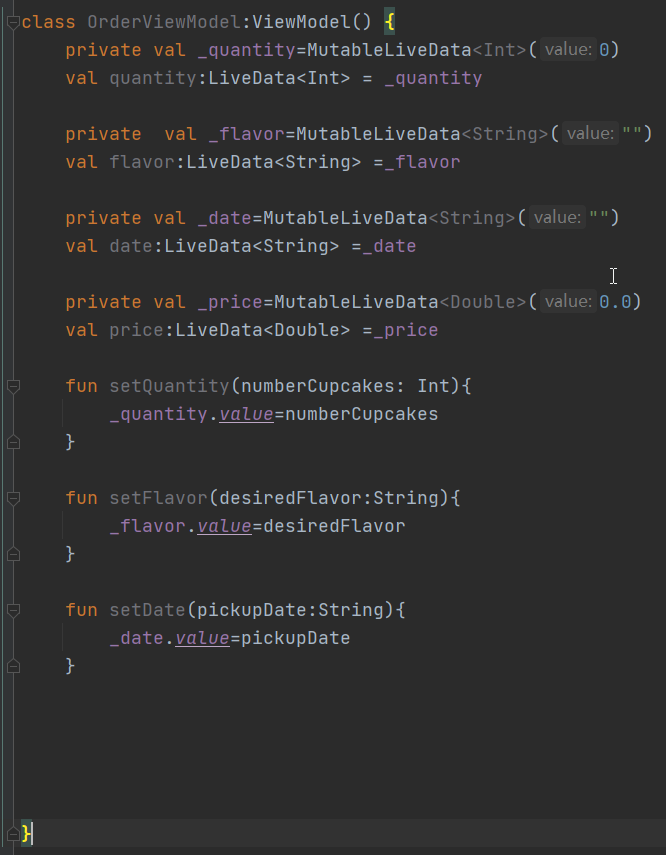

# 4.高级Navigation应用示例

## 4.1.Fragment之间的Shared VIewModel

### 学习内容

- 在更高级的用例中实现建议的应用架构做法
- 如何在activity和fragment之间使用共享VIewModel
- 如何应用LiveData转换

### 初始化viewModel代码格式



### apply作用域函数

这可能是您首次看到 Kotlin 中的 `apply` 函数。`apply` 是 Kotlin 标准库中的[作用域函数](https://kotlinlang.org/docs/reference/scope-functions.html)。它在对象的上下文中执行代码块。它会形成一个临时作用域，在该作用域中，您可以访问对象而不需要其名称。`apply` 的常见用例是配置对象。此类调用可以解读为“对对象应用以下赋值”。

**示例**：

```kotlin
clark.apply {
    firstName = "Clark"
    lastName = "James"
    age = 18
}

// The equivalent code without apply scope function would look like the following.

clark.firstName = "Clark"
clark.lastName = "James"
clark.age = 18
```

