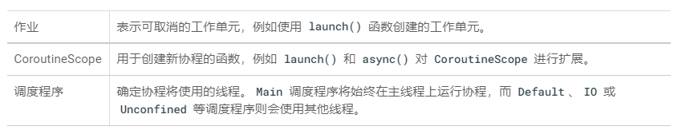

# kotlin协程

可以更加灵活、简单的方式管理并发。

协程能够处理多任务，但比直接使用线程更为抽象。协程的一项重要功能是能够存储状态，以便协程可以暂停和恢复。协程可以执行，也可以不执行。

借助状态（由“连续性”表示），部分代码可以在需要移交控制权或需要等待其他协程完成后才能恢复时发出信号。此流程称为“协作式多任务处理。Kotlin的协程实现增加了一些协助处理多任务的功能。除了连续性以外，创建协程还涉及到作用于CoroutineScope内的Job（具有生命周期的可取消工作单元）的内容。CoroutineScope表示以递归方式对其子级以及这些子级的子级强制执行取消和其他规则的一种上下文。Dispatcher会管理协程将使用哪个后备线程来执行任务，从而使开发者无需管理使用新线程的时间和位置。



## Retrofit2

对 Retrofit 对象调用 create() 函数的成本很高，且应用只需一个 Retrofit API 服务实例。因此，您可以使用对象声明向应用的其余部分公开该服务。

```kotlin
object MarsApi{     
	val retrofitService:MarsApiService by lazy {         										retrofit.create(MarsApiService::class.java)     
	}
}
```

`by lazy`是惰性实例化，特意延迟创建对象，直到需要该对象为止，避免不必要的计算或使用其他计算资源。

