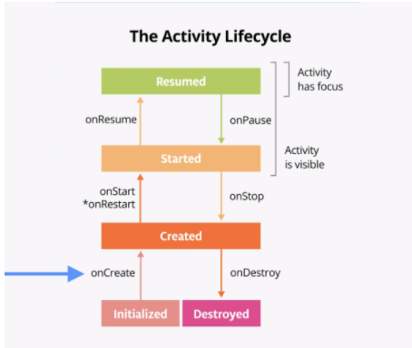
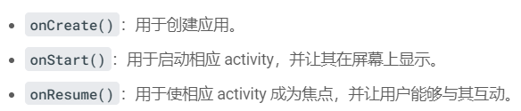

# 安卓学习01

## 关于初始化界面的函数

```kotlin
//初始化菜单栏
override fun onCreateOptionsMenu(menu: Menu?): Boolean {
    menuInflater.inflate(R.menu.layout_menu,menu)

    val layoutButton=menu?.findItem(R.id.action_switch_layout)
    setIcon(layoutButton)
    return true
}

    //检测点击菜单键
    override fun onOptionsItemSelected(item: MenuItem): Boolean {
        return when(item.itemId){
            R.id.action_switch_layout->{
                isLinearLayoutManager= !isLinearLayoutManager
                chooseLayout()
                setIcon(item)
                return true
            }
            else->super.onOptionsItemSelected(item)
        }
    }
```

## 伴生对象（在类里定义常量）

使用`companion class object(){}`定义常量，类中的数据都用`const`定义

## kotlin中的控制流

`when`类似于Java中的`switch`语句

```kotlin
when (x) {
    1 -> print("x == 1")
    2 -> print("x == 2")
    else -> { // Note the block
        print("x is neither 1 nor 2")
    }
}
```

## 生命周期



在模拟器中切换最近的应用时，会重新调用`onStart()`方法



```kotlin
//在activity销毁时保存部分信息的函数
override fun onSaveInstanceState(outState: Bundle, outPersistentState: PersistableBundle) {
    super.onSaveInstanceState(outState, outPersistentState)
    Log.d(TAG,"onSaveInstanceState Called")
}
```

