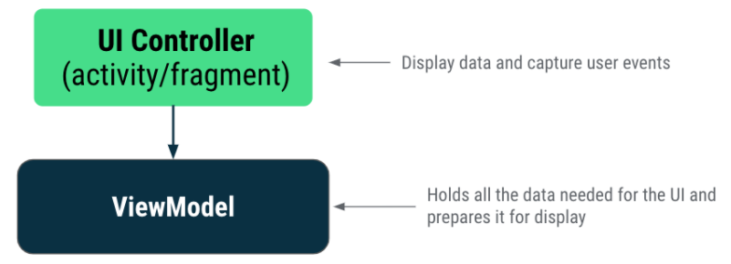
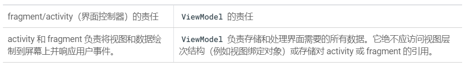
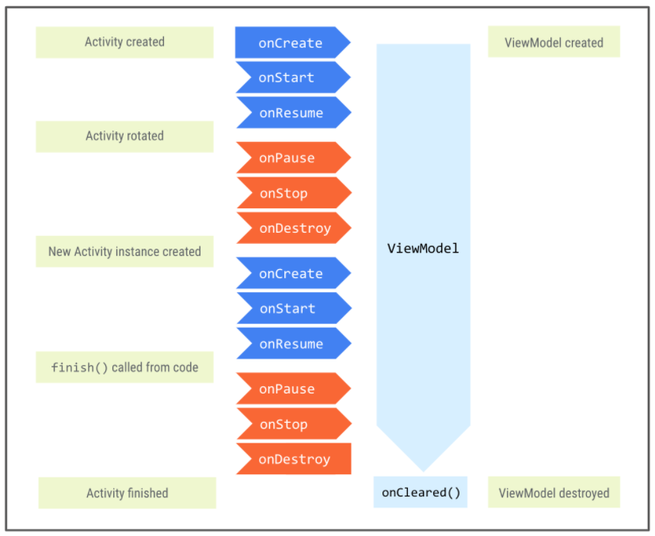
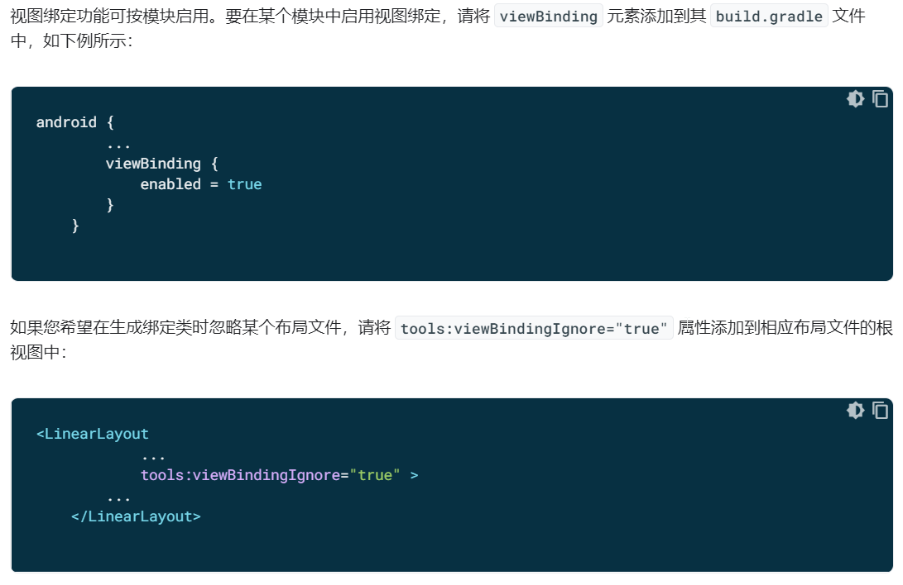

# 安卓学习03

## 应用架构

最常用的架构原则是：**分离关注点**和**通过模型驱动界面**

### 分离关注点

应将应用分为类，每个类有各自的任务

### 通过模型驱动界面

通过模型驱动界面（最好是持久性模型）。模型是负责处理应用数据的组件。它们独立于应用中的Views和应用组件，因此不受应用的生命周期以及相关的关注点影响。

Android架构中主要的类或组件是界面控制器（activity/fragment）、ViewModel、LiveData和Room。



#### 界面控制器（Activity/Fragment）

activity和fragment是界面控制器。界面控制器通过在屏幕上回执试图、捕获用户事件以及与用户与之互动的界面相关的所有其他操作来控制界面。**应用中的数据或有关该数据的任何决策逻辑都不应放到界面控制器类中。**

Android系统可能会根据某些用户互动情况或因内存不足等系统条件而随时销毁界面控制器。由于这些事件不受编程人员控制，因此要将有关数据的决策逻辑添加到ViewModel中。

#### ViewModel

ViewModel是视图中显示的应用数据的模型。模型是负责处理应用数据的组件，能够让应用遵循架构原则，通过模型驱动界面。

ViewModel存储应用相关的数据，这些数据不会再Android框架小鬼并重新创建Activity或Fragment时销毁。在配置更改期间会自动保留ViewModel对象（不会像界面控制器一样销毁），以便它们存储的数据立即可供下一个activity或fragment实例使用。

#### 总结：



## Kotlin中的属性委托

```kotlin
private val viewModel: GameViewModel by viewModels()
```

在Kotlin中，每个可变（var）属性都具有自动为其生成的默认getter和setter函数。当为该属性赋值或读取其值时，系统会调用setter和getter函数。

只读属性（val）与可变属性不同，默认进生成getter函数。

Kotlin中的属性委托可以将getter和setter的责任移交给另一个类，称为委托类。delegate属性使用by和delegate类实例进行定义。

## Kotlin中的后备属性

```kotlin
// Declare private mutable variable that can only be modified 
// within the class it is declared.
private var _count = 0  

// Declare another public immutable field and override its getter method.
// Return the private property's value in the getter method.
// When count is accessed, the get() function is called and // the value of _count is returned.
val count: Int    
	get() = _count
```

在ViewModel类内：

- _count属性设为private且可变。因此只能在ViewModel类中对其进行访问和修改。惯例是为private属性添加下划线前缀。

在ViewModel类外：

- Kotlin 中的默认可见性修饰符为 public，因此 count 是公共属性，可从界面控制器等其他类对其进行访问。由于只有 get() 方法会被替换，所以此属性不可变且为只读状态。当外部类访问此属性时，它会返回 _count 的值且其值无法修改。这可以防止外部类擅自对 ViewModel 内的应用数据进行不安全的更改，但允许外部调用方安全地访问该应用数据的值。

## ViewModel的生命周期



## LiveData

是一种具有生命周期感知能力、可观察的数据存储器类

LiveData的部分特性如下：

- 可存储数据；Livedata是一种可存储任何类型的数据的封装容器
- LiveData是可观察的，意味着当LiveData对象存储的数据发生更改时，观察器会收到通知
- LiveData具有哦生命周期感知能力。当将观察器附加到LiveData后，观察器就会与LifecycleOwner（通常是Activity和Fragment）相关联。LiveData仅更新处于活跃生命周期状态的观察器。

## 视图绑定

使用绑定好的视图中的数据可以直接通过binding.类型，可以避免使用findviewbyId

### 视图绑定使用方法：



为某个模块启用视图绑定功能后，系统会为该模块中包含的每个XML布局文件生成一个绑定类。每个绑定类均包含对根视图以及具有ID的所有视图的引用。系统会通过一下方式生成绑定类的名称：将XML文件的名称转换为驼峰式大小写，并在末尾添加“Binding”一词。

```xml
<LinearLayout ... >
        <TextView android:id="@+id/name" />
        <ImageView android:cropToPadding="true" />
        <Button android:id="@+id/button"
            android:background="@drawable/rounded_button" />
    </LinearLayout>
```

