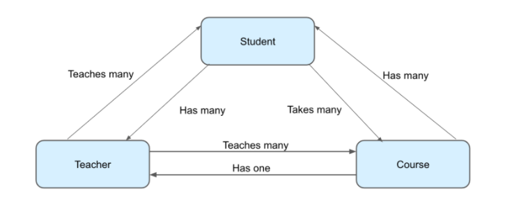

# 安卓数据存储

## 关系型数据库概览

数据库是一种可以通过电子方式访问和写入的结构化数据集合。在移动设备上，数据库通常保存正在运行的应用中的数据，以便在下下次打开该应用时无需从互联网等其他来源检索这些数据即可对其进行访问。这就是所说的数据持久性。

关系型数据库是一种常用的数据库类型，他将数据整理成表、列和行。代码中表示对象的类与关系型数据库中的表有相同的作用。除了表示数据之外，表还可以表示其他表



## 使用Room和Flow进行数据存储

### Entity 实体类

```kotlin
import androidx.annotation.NonNull
import androidx.room.ColumnInfo
import androidx.room.Entity
import androidx.room.PrimaryKey

@Entity
data class Schedule(
    @PrimaryKey val id:Int,
    @NonNull @ColumnInfo(name = "stop_name") val stopName:String,
    @NonNull @ColumnInfo(name = "arrival_time") val arrivalTime:Int
)
```

### 定义DAO

DAO代表数据访问对象 ，是一个提供数据访问的Kotlin类。具体来说，DAO中包含用于读取和操作数据的函数。对DAO调用函数相当于对数据库执行 SQ命令